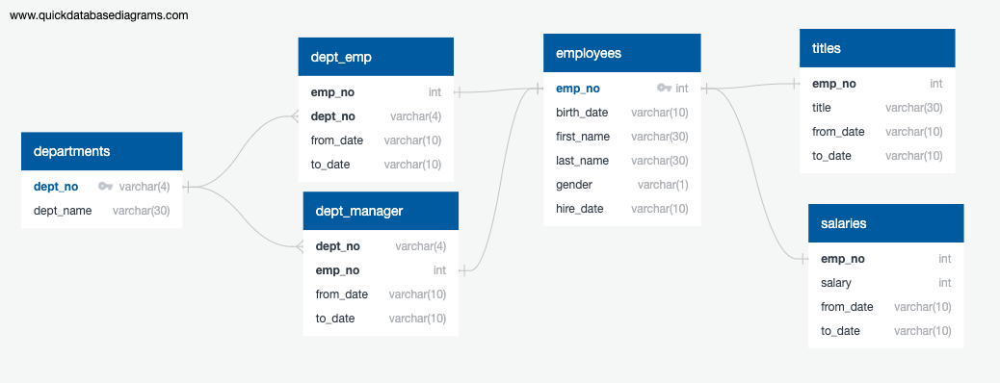

# Background

It is a beautiful spring day, and it is two weeks since you have been hired as a new data engineer at Pewlett Hackard. Your first major task is a research project on employees of the corporation from the 1980s and 1990s. All that remain of the database of employees from that period are six CSV files.

In this assignment, you will design the tables to hold data in the CSVs, import the CSVs into a SQL database, and answer questions about the data. In other words, you will perform:

* Data Modeling
* Data Engineering
* Data Analysis

# Data Modeling

Inspect the CSVs and sketch out an ERD of the tables. Feel free to use a tool like [http://www.quickdatabasediagrams.com](http://www.quickdatabasediagrams.com).



# Data Engineering

* Use the information you have to create a table schema for each of the six CSV files. Remember to specify data types, primary keys, foreign keys, and other constraints.
```sql
CREATE TABLE employees (
    emp_no int NOT NULL,
    birth_date varchar(10) NOT NULL,
    first_name varchar(30) NOT NULL,
    last_name varchar(30) NOT NULL,
    gender varchar(1) NOT NULL,
    hire_date varchar(10) NOT NULL
);
CREATE TABLE departments (
    dept_no varchar(4) NOT NULL,
    dept_name varchar(30) NOT NULL
);
CREATE TABLE dept_emp (
    emp_no int NOT NULL,
    dept_no varchar(4) NOT NULL,
    from_date varchar(10) NOT NULL,
    to_date varchar(10) NOT NULL
);
CREATE TABLE dept_manager (
    dept_no varchar(4) NOT NULL,
    emp_no int NOT NULL,
    from_date varchar(10) NOT NULL,
    to_date varchar(10) NOT NULL
);
CREATE TABLE salaries (
    emp_no int NOT NULL,
    salary int NOT NULL,
    from_date varchar(10) NOT NULL,
    to_date varchar(10) NOT NULL
);
CREATE TABLE titles (
    emp_no int NOT NULL,
    title varchar(30) NOT NULL,
    from_date varchar(10) NOT NULL,
    to_date varchar(10) NOT NULL
);
```

* Import each CSV file into the corresponding SQL table.
